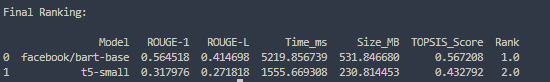

# 🚀 Kanishka Summarization TOPSIS

A Command-Line Interface (CLI) tool to compare and rank HuggingFace text summarization models using the TOPSIS (Technique for Order Preference by Similarity to Ideal Solution) method.

---

## 📌 What This Tool Does

This tool:

- Downloads summarization models from HuggingFace
- Generates summaries
- Computes evaluation metrics:
  - ROUGE-1 (Benefit)
  - ROUGE-L (Benefit)
  - Inference Time (Cost)
  - Model Size (Cost)
- Applies TOPSIS multi-criteria ranking
- Outputs ranked models

---

## 🧠 Evaluation Criteria

| Criterion | Type    | Description                                            |
| --------- | ------- | ------------------------------------------------------ |
| ROUGE-1   | Benefit | Measures unigram overlap between summary and reference |
| ROUGE-L   | Benefit | Measures longest common subsequence similarity         |
| Time (ms) | Cost    | Total inference time                                   |
| Size (MB) | Cost    | Model size in memory                                   |

---

## 📂 Project Structure

TextSummarizationModels/

│

├── summarization_model_selector/

│   ├──  **init** .py

│   ├── cli.py

│   ├── topsis.py

│

├── setup.cfg

├── pyproject.toml

├── README.md

└── data.csv


## 📦 Installation

### 🔹 Option 1: Install from PyPI


```bash
pip install kanishka-summarization-topsis
```


## 📝 Dataset Format

Your CSV file must contain:

```

text,reference
Example: 

text,reference
"Artificial intelligence is transforming industries by enabling machines to learn from data.","AI enables machines to learn and transform industries."
"Climate change is causing rising temperatures and extreme weather.
```


## ▶️ How To Run

Basic usage:

<pre class="overflow-visible! px-0!" data-start="2287" data-end="2372"><div class="contain-inline-size rounded-2xl corner-superellipse/1.1 relative bg-token-sidebar-surface-primary"><div class="sticky top-[calc(var(--sticky-padding-top)+9*var(--spacing))]"><div class="absolute end-0 bottom-0 flex h-9 items-center pe-2"><div class="bg-token-bg-elevated-secondary text-token-text-secondary flex items-center gap-4 rounded-sm px-2 font-sans text-xs"></div></div></div><div class="overflow-y-auto p-4" dir="ltr"><code class="whitespace-pre! language-bash"><span><span>model-compare-sum --models facebook/bart-base,t5-small --dataset data.csv</span></span></code></div></div></pre>


## 📈 TOPSIS Weights Used

Default weights:

<pre class="overflow-visible! px-0!" data-start="3378" data-end="3410"><div class="contain-inline-size rounded-2xl corner-superellipse/1.1 relative bg-token-sidebar-surface-primary"><div class="sticky top-[calc(var(--sticky-padding-top)+9*var(--spacing))]"><div class="absolute end-0 bottom-0 flex h-9 items-center pe-2"><div class="bg-token-bg-elevated-secondary text-token-text-secondary flex items-center gap-4 rounded-sm px-2 font-sans text-xs"></div></div></div><div class="overflow-y-auto p-4" dir="ltr"><code class="whitespace-pre!"><span><span>[</span><span>0.35, 0.35, 0.15, 0.15</span><span>]
</span></span></code></div></div></pre>

Where:

* ROUGE-1 → 0.35
* ROUGE-L → 0.35
* Time → 0.15
* Size → 0.15


## 🔥 Recommended Models

* facebook/bart-base
* facebook/bart-large-cnn
* t5-small
* google/pegasus-xsum

# 📊 Example Output



## 🏆 Author

Kanishka Rani

Computer Science Engineering
